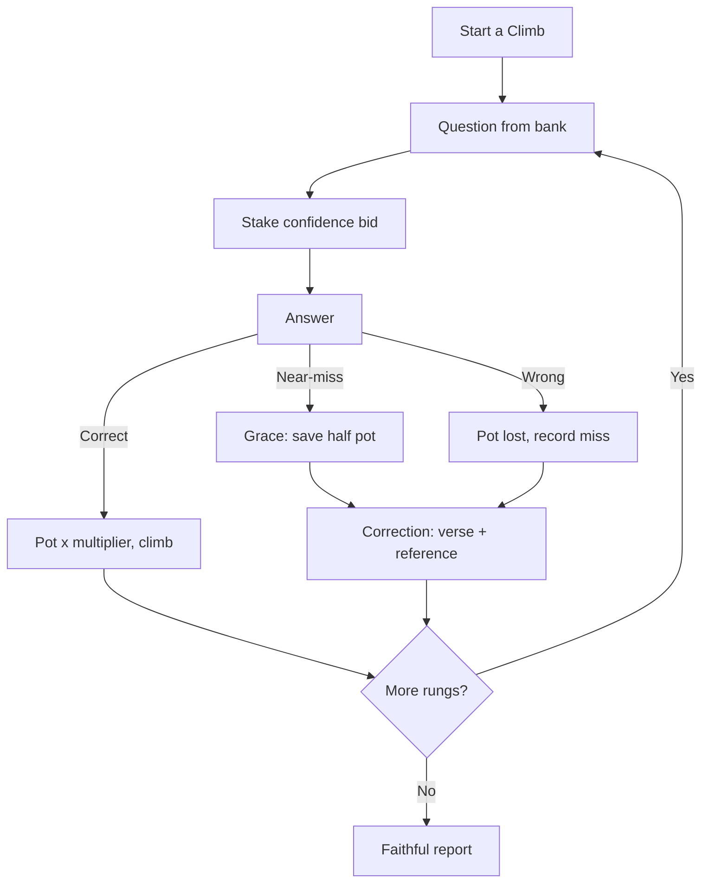
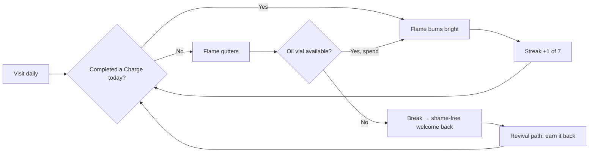

# Sound Doctrine — Game Design Document (Living)

> Status legend: **🟢 shipped** · **🟡 spec'd, not built** · **⚪ planned, unscoped**
> Companion docs: `docs/UI-UX.md` (flow, screens, identity, leaderboard) ·
> `docs/research-notes.md` (the "why" each mechanic works, with sources).

## 1. Vision

A Scripture study game on **1 & 2 Timothy and Titus (KJV)** that is genuinely *fun to
come back to* — tense to play, kind to lose, and always grounded in the text. Three
books, one charge, an endless ladder of knowledge.

**One-line promise:** *Climb the charge. Keep the flame. Know the doctrine.*

**Design pillars:**
1. **Scripture is the engine** — every answer, distractor, and correction is a real verse
   (machine-verified against the KJV lockbox). The AI may frame, adapt, and personalize,
   but **never invents**.
2. **Tension over trivia** — progression carries risk (the Ladder), not just points.
3. **Kind retention** — streaks are capped and forgiving (the Candle), never a guilt trap.
4. **Shared ritual** — a once-a-day common challenge + leaderboard (the Daily Quest).

## 2. The three systems (adopted from research)

A full mechanics trace lives in `docs/research-notes.md`; here is the spec.

---

### 2.1 The Ladder — core adrenaline loop 🟢 (shipped)

**Adopts:** double-or-nothing risk (Problyx *The Ladder*, Cash Cab) + near-miss effect +
goal-gradient (Wordle).

- Player ascends rungs by answering. Each rung = one question from the verified bank,
  chosen by difficulty tier and adaptive need.
- **Before seeing options**, the player stakes a **confidence bid**:
  - `Confident` (1×) — safe, steady.
  - `Certain` (2×) — double the pot.
  - `"I'll preach it"` (3×) — all-in flourish.
- Outcome:
  - **Correct** → pot × bid multiplier; climb a rung.
  - **Near-miss** (chose a *credible, real-verse distractor* — i.e. you knew the *book's
    voice* but not the exact verse) → **Grace**: keep half the pot (not zero), then the
    scriptural correction.
  - **Wrong** → pot for that climb is lost; correction shown; the *subject* is marked
    for re-testing (adaptive).
- **Adaptive difficulty**: subjects you miss return, one tier harder; subjects you
  master step down in frequency. Balances "expose gaps" with "stay engaged."
- A climb ends in the **faithful report** — session weak/strong spots (the study report,
  made *the reward* rather than an appendage).

---

### 2.2 The Candle — retention / identity 🟢 (shipped)

**Adopts:** streak→identity + capped streaks + recovery ("Streak Shield") (Yu-kai Chou /
Duolingo), Appointment Dynamics.

- Progress is a **lamp flame** on the home screen, not a scoreboard number.
- **7-day capped streak** (per Chou: cap avoids infinite-dread burnout). A separate
  **lifetime total-days** counter absorbs the long-term pride.
- **Oil vials** = earned streak shields (a "Streak Freeze" equivalent). Spend one to keep
  the flame through a missed day.
- **Gutter, never cliff**: miss a day and the flame *gutters* (gentle ramp-down); it is
  never catastrophically snuffed with shame. Broken → **welcome-back + revival path**
  (earn the streak back with play, never pay).
- The daily "keep it lit" visit is the **Appointment Dynamic** that builds the habit.

---

### 2.3 The Daily Quest — shared social engine 🟢 (shipped)

**Adopts:** NYT one-a-day + share-card ritual + shared-social payoff; fairness through
a common seed.

- One **10-question timed Quest** per calendar day, **identical for every player**
  (seeded by date) → everyone climbs the *same* rungs, so competition is fair.
- Ends in a **spoiler-safe share card**: emoji grid (⩝⩞⩟) + accuracy % + solve time,
  posted to the men's chat/leaderboard.
- Pacing is *quiet* (no infinite scroll); the scarcity of "one per day" is the hook.

---

## 3. Difficulty & progression (easy → extremely hard)

The climb is **strictly progressive**: a player cannot reach a hard rung without
earning it, and the whole ladder escalates from recall to synthesis. Difficulty is a
**ladder of rungs (tiers)**, not a flat 1–3 number.

### 3.1 Tier ladder (progressive)

| Tier | Name (ladder rung) | What it demands | Example |
|---|---|---|---|
| T1 | **Recall** | Recognize a verse / fill a word | "…the love of ______ is the root of all evil" |
| T2 | **Recall (multi)** | Match book/chapter to a fact | "Which book names Lois & Eunice?" |
| T3 | **Reference** | Correct chapter:verse from a passage | "Where does Paul say 'a crown of righteousness'?" |
| T4 | **Discern** | Distinguish near-identical verses (real-verse distractors) | "Which is 2 Tim 4:7, not 1 Tim 6:12?" |
| T5 | **Sequence / exact wording** | Reconstruct a verse's exact KJV sequence | Order the mystery-of-godliness clauses (1 Tim 3:16) |
| T6 | **Cross-reference** | Tie two verses from *different* books | "Where do 'fight the good fight' and 'war a good warfare' each appear?" |
| T7 | **Synthesis ("extremely hard")** | Derive doctrine across all three books, still objectively answerable | "Which single subject do 1 Tim 6, 2 Tim 3, and Titus 1 all warn against? (cite the references)" |

- The **166-question bank** covers **T1–T7** (T1 17 / T2 20 / T3 48 / T4 33 /
  T5 16 / T6 18 / T7 14).
- Tiers **unlock sequentially** within a climb: board the ladder at T1, advance a tier
  after a correct answer in the current tier (or a near-miss *grace* in T3+).

### 3.2 Difficulty scaling rules

- **Difficulty = question type + timing + adaptive pressure**, never guesswork:
  - Each tier adds one **question-type** capability (recall → reference → discern → …).
  - `difficulty` in the data becomes the *tier* (1–7), mapped as above.
  - The per-question **count-up timer** feeds the leaderboard, but harder tiers may
    tighten a *suggested* pace (shown as a soft "steady / swift / burn" hint), never a cliff.

### 3.3 Adaptive personalization (easy→hard *per player*)

- **Per-player model** (Supabase): accuracy per `subject`, per `book`, per `chapter`, per
  `tier`.
- **Advance** a player's *personal* entry tier when they clear the floor of a tier with
  ≤1 grace; **detour down** one tier on a subject when that subject is missed twice at
  the current tier (gaps exposed, then rebuilt).
- **Anti-repetition**: recently-seen questions are suppressed; the bank is large enough
  (and grows with T6–T7) to prevent predictability.
- **AI's role**: personalization weights and report prose *may* be model-assisted at
  *generation* time; **verse content is pinned to the lockbox — never live-invented.**

## 4. Scoring, ranking & the Charge Report

### 4.1 In-game scoring

- **Ladder score**: cumulative pot across a climb (bid multipliers + grace logic).
- **Composite leaderboard score** (blend, tuned transparently):
  `accuracy × streak-weight × (1 − normalized best-time)`, fails as tiebreaker.
- **Rank titles**: `Recruit → Squire → Deacon → Elder in Training → Elder → Bishop →
  Good Soldier → Workman Unashamed → Shepherd → Crownbearer`.

### 4.2 The Charge Report — post-game grading + "how to do better"

After every climb (and every Daily Quest), the player gets a **Charge Report**, which is
the *reward* of finishing, not an afterthought. It has four parts:

1. **Grade** — a letter + title from the composite:
   - **S+ "Teacher of Sound Doctrine"** (≥90%) · **A "Workman Unashamed"** (≥80%) ·
     **B "Rightly Dividing"** (≥65%) · **C "A Good Soldier"** (≥50%) ·
     **D "Child in the Faith"** (<50%).
2. **Strengths** — top 3 subjects/books/chapters by accuracy (shown as *"You held fast"*).
3. **Weaknesses** — bottom 3 (shown as *"strengthen your charge"*), each tagged with the
   **exact references to revisit** (e.g. *"the widows & elders passages — 1 Tim 5"*).
4. **"How to do better" — a per-gap study prescription**, three concrete actions, e.g.:
   > *"You missed the 'faithful sayings' subject twice. Read the five 'faithful saying'
   > verses side by side — 1 Tim 1:15, 3:1, 4:9, 2 Tim 2:11, Titus 3:8 — and the next
   > climb will drop straight back to skill.""*

Rules for the prescription (so it stays scriptural and never preachy):
- Every recommendation **cites chapter:verse** that already passed the lockbox verifier.
- Wording is *shepherding*, never shame (see §5).
- The same data feeds the **lifetime report** (weak books/chapters/subjects over time),
  so "how to do better" compounds across sessions.

## 5. Winning / anti-patterns

The game is "won" by *knowing the doctrine*, not by grinding:
- No pay-to-win, no ads, no loot-box economy.
- Daily caps (anti-compulsion), paired with a separate **Study mode** (untimed).
- Loss is always framed as **correction** (2 Tim 3:16's "for reproof, for correction").

## 6. Challenge-rule traceability

| Rule | How we satisfy it |
|---|---|
| 1. Q&A from the 3 books only | all verses pinned to lockbox; verifier rejects foreign refs |
| 2. Objective, verifiable answers | completion/recall/number-based on exact KJV wording |
| 3. Correction cites Scripture | every miss shows verse + reference (emotionally central) |
| 4. Credible distractors from same books | distractors are real verses/phrases from 1/2 Tim & Titus |
| 5. AI restricted to supplied text | no model at play time; generation-time only |
| 6. Builder personally verifies | `verify/check.mjs` + mandated manual KJV spot-check |
| 7. Works on mobile | mobile-first PWA layout; Supabase only for leaderboard |

## 7. Status matrix (living)

| System | Status |
|---|---|
| Verified 166-question bank (7-tier, 6-gate KJV lockbox) | 🟢 shipped (`data/questions-merged.json` canonical, D2) |
| The Ladder (progressive T1→T7 ramp, adaptive weak-subject picker, countdown) | 🟢 shipped |
| The Candle (capped 7-day streak, oil shields, gutter) + Flame card + Ladder on Home | 🟢 shipped (Phase 4: visual Ladder T7→T1 with 🔥YOU, Flame card, Daily Quest card) |
| **7-tier progression (T1–T7)** | 🟢 shipped (all tiers authored & verified: T1 17 / T2 20 / T3 48 / T4 33 / T5 16 / T6 18 / T7 14) |
| **Confidence stake — two-step (D3): answer → stake card 1×…5×, Grace half** | 🟢 shipped (Phase 6: `BIDS` 5-tier, `resolveAnswer(q, idx, bid)` → ± stake×100, Grace 50% via `nearIndexes`) |
| **Charge Report: Mastery Map + Weakest + Missed Verses + Retest** | 🟢 shipped (Phase 5: per-book mastery bars, weakest-chapter card, missed-verse list, `[Retest My Weakness]`) |
| Named players + profile stats (streak / fails / best time) | 🟢 shipped (local profile) |
| The Daily Quest (seeded daily + share card) | 🟢 shipped |
| Global real-time leaderboard (Supabase) | 🟡 spec'd — local board shipped; backend needs Supabase project |
| AI pipeline (build-time only, D5) | 🟢 shipped (`scripts/ai-generate.mjs` + `scripts/merge-ai.mjs` + `docs/AI-PIPELINE.md`, 6-gate) |
| Supabase auth + cloud sync | ⚪ planned (needs approval + project) |

*This document is living: update the status matrix and sections here as features ship.*
